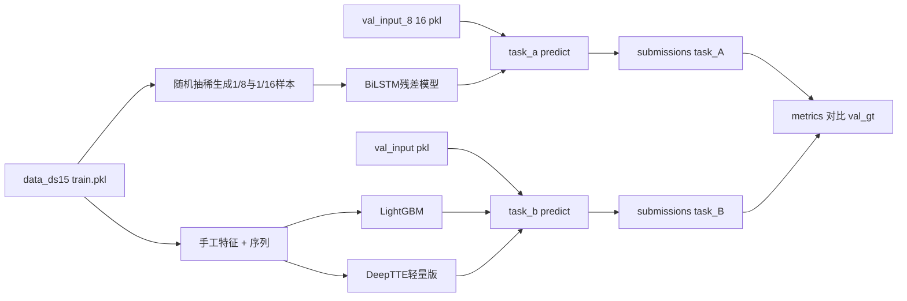

# 西安出租车轨迹建模方案（新手友好版）

> 阅读建议：从头到尾按顺序读一遍，再回到"阶段 0"开始动手。每个阶段的结构都是 **目标 → 思路 → 步骤 → 验收标准**。

---

## 〇、整体心智模型

### 这两个任务到底在干什么

- **任务 A 轨迹修复**：原本一条出租车轨迹在 `data_ds15` 里大概 15 秒采一个 GPS 点，每条 50~240 个点。出题人把其中 7/8 或 15/16 的点偷偷涂掉变成 `NaN`，要求我们**猜回**那些点的经纬度。时间戳全都还在，所以我们知道"哪个时刻有一个空缺"。
- **任务 B 行程时间估计 (TTE)**：给我们一条**完整的路径**（所有 GPS 点都在）和**出发时间**，但不告诉我们到达时间，要我们预测**总共开了多少秒**。

两个任务都给了 `val_input` 与 `val_gt`：可以在本地反复评测，知道自己模型有多准。课堂当场会发同格式的 `test_input`，要现场跑出预测文件提交。

### 为什么我们的方案分"基线 + 深度学习"两层

- **基线**：用最简单的数学方法（插值、平均速度、决策树）做出第一版，**保证有提交、知道难度下限**。这通常 1~2 天就能搞定。
- **深度学习**：在基线之上，引入序列模型学习"基线没法解释的非线性偏差"。这是拿"方法创新 40%"分数的关键。
- **数据规模优势**：训练集 13.2 万条轨迹，足够喂神经网络。

### 关键评测指标快速理解

- **MAE（Mean Absolute Error）**：平均绝对误差。任务 A 是"每个被预测点和真实点的 Haversine 距离（地球表面距离，单位米）的平均"；任务 B 是"预测秒数和真实秒数差的绝对值的平均"。
- **RMSE**：均方根误差，对大错误更敏感（先平方再开根号）。
- **MAPE**：平均绝对百分比误差。`|预测-真实| / 真实` 的平均。任务 B 才有，对短行程惩罚很大（比如真实 60 秒预测 90 秒就是 50% 误差）。
- **Haversine 距离**：地球是球面，两个经纬度点之间的"球面弧长"，公式已经在 [scripts/_viz_utils.py](scripts/_viz_utils.py) 第 52 行 `haversine_distance_km` 里写好了，乘 1000 就是米。

---

## 一、要交付什么（最终产物清单）

- 4 份预测 pkl：
  - `submissions/task_A/pred_8.pkl`（来自 `val_input_8.pkl`）
  - `submissions/task_A/pred_16.pkl`（来自 `val_input_16.pkl`）
  - `submissions/task_B/pred.pkl`（来自 `val_input.pkl`）
  - 课堂测试同样三份 test 版本（脚本一样，输入换成 `test_input_*.pkl`）
- 一份可一键复现的代码工程（`src/` + `configs/` + 现有 `scripts/`）
- 一张实验对比表 + 几张误差分析图，用于报告与汇报
- 8~15 页 PDF 报告 + PPT

---

## 二、目录结构（现状 + 新增）

现状（已有，可直接复用）：

- [scripts/visualize_dataset.py](scripts/visualize_dataset.py)、[scripts/visualize_recovery.py](scripts/visualize_recovery.py)、[scripts/visualize_tte.py](scripts/visualize_tte.py)：可视化脚本
- [scripts/_viz_utils.py](scripts/_viz_utils.py)：里面已经有 `load_pickle` / `haversine_distance_km` / `route_length_km` / `to_local_datetime`，**直接复用**，不要重复造轮子
- [outputs/](outputs/)：已生成的可视化图

需要新增（先不写代码，先建好空目录，写说明里给出的接口）：

```text
src/
  common/
    __init__.py
    io.py                 # pkl 读写、提交格式校验
    geo.py                # ENU 投影、Haversine（包装 _viz_utils）
    metrics.py            # MAE/RMSE/MAPE 计算
    splits.py             # train/val/test 划分（任务 A 训练时用）
  task_a/
    __init__.py
    baseline_interp.py    # 线性 / 三次样条 / 卡尔曼 三档基线（不需要训练）
    dataset.py            # PyTorch Dataset：随机抽稀生成训练样本
    model.py              # BiLSTM 残差网络
    train.py              # 训练入口
    predict.py            # 推理入口（基线 / 深度模型可切换）
  task_b/
    __init__.py
    baseline_speed.py     # 按小时分组的平均速度基线
    baseline_gbm.py       # LightGBM + 手工特征
    dataset.py            # PyTorch Dataset
    model.py              # DeepTTE 轻量版
    train.py
    predict.py
configs/
  task_a_lstm.yaml        # 模型超参、数据路径
  task_b_dl.yaml
submissions/
  task_A/
  task_B/
checkpoints/
  task_a/
  task_b/
requirements.txt
```

---

## 三、阶段 0：环境与数据自检（半天）

### 目标

确保 Python 环境装好，并能加载 4 个关键 pkl 文件，把字段都打出来看一眼。**不写任何模型代码**。

### 思路

很多新手会一上来就写模型，结果调试时发现字段名拼错、维度对不上。先用 5 行脚本把数据"摸一遍"，把每条数据长什么样钉在心里，后面写模型才不会出错。

### 步骤

1. **建虚拟环境**（任选其一）：
  - venv：`python -m venv .venv` 然后激活
  - conda：`conda create -n taxi python=3.10`
2. **创建 `requirements.txt**`，至少包含：
  ```text
   numpy>=1.24
   scipy>=1.11
   pandas>=2.0
   matplotlib>=3.7
   scikit-learn>=1.3
   lightgbm>=4.0
   torch>=2.0
   tqdm>=4.65
   pyyaml>=6.0
  ```
3. **写一个 `scripts/inspect_data.py**` 把 4 个文件加载并打印第一条样本的字段：
  ```python
   import pickle
   from pathlib import Path

   ROOT = Path(__file__).resolve().parents[1]
   for path in [
       ROOT / "data_ds15" / "val.pkl",
       ROOT / "task_A_recovery" / "val_input_8.pkl",
       ROOT / "task_A_recovery" / "val_gt.pkl",
       ROOT / "task_B_tte" / "val_input.pkl",
       ROOT / "task_B_tte" / "val_gt.pkl",
   ]:
       data = pickle.load(open(path, "rb"))
       print(path.name, "样本数:", len(data))
       print("第一条字段:", list(data[0].keys()))
       print("第一条样例:", {k: type(v).__name__ for k, v in data[0].items()})
       print()
  ```
4. **跑一遍现有可视化**确认数据没问题：`python scripts/visualize_dataset.py` 等三个脚本，确认 `outputs/` 下图能正常更新。

### 验收标准

- 能成功打印 5 个文件的字段名，且与 `任务说明.txt` 完全对得上：
  - `data_ds15/val.pkl` → `vehicle_id, order_id, coords, timestamps`
  - `task_A_recovery/val_input_*.pkl` → `traj_id, timestamps, coords, mask`
  - `task_A_recovery/val_gt.pkl` → `traj_id, coords, timestamps`
  - `task_B_tte/val_input.pkl` → `traj_id, coords, departure_timestamp`
  - `task_B_tte/val_gt.pkl` → `traj_id, travel_time`
- 可视化脚本能跑通

---

## 四、阶段 1：公共工具与"最朴素提交"（半天）

### 目标

写好 3 个公共模块，并先用最笨的"线性插值/平均时间"方法跑出 4 份**能合法提交的 pkl**（哪怕分数很差），形成完整闭环。

### 为什么先做这一步

闭环 > 局部最优。先把"读数据 → 预测 → 写文件 → 评测"这一整条流水线跑通，后面只需替换"预测"一环就能不断改进。

### 步骤

#### 4.1 `src/common/io.py`：读写与校验

```python
import pickle
from pathlib import Path

def load_pkl(path):
    with open(path, "rb") as f:
        return pickle.load(f)

def save_pkl(obj, path):
    Path(path).parent.mkdir(parents=True, exist_ok=True)
    with open(path, "wb") as f:
        pickle.dump(obj, f)

def validate_submission_a(pred_list, ref_list):
    """检查 A 任务提交：每条要有 traj_id 和 coords，长度相等，无 NaN。"""
    ref_map = {item["traj_id"]: len(item["coords"]) for item in ref_list}
    for item in pred_list:
        assert item["traj_id"] in ref_map
        assert len(item["coords"]) == ref_map[item["traj_id"]]
        # 还需检查所有坐标非 NaN

def validate_submission_b(pred_list, ref_list):
    ref_ids = {item["traj_id"] for item in ref_list}
    for item in pred_list:
        assert item["traj_id"] in ref_ids
        assert isinstance(item["travel_time"], (int, float))
```

#### 4.2 `src/common/geo.py`：投影与 Haversine

**为什么要做 ENU 投影**：经纬度在地球上不是欧氏空间（1 度经度的实际米数随纬度变化）。我们直接对经纬度做"加减平均"会有误差。把每条轨迹的所有点以**该轨迹首个有效点为原点**，转成 (x, y) 米平面坐标，后面所有插值/神经网络都在这个平面里做，最后再换回经纬度。西安南北跨度小，这种局部投影误差可忽略。

```python
import numpy as np

EARTH_R = 6371008.8  # 米

def lonlat_to_enu(lon, lat, lon0, lat0):
    """以 (lon0, lat0) 为原点的本地东-北平面投影（小区域近似）。"""
    lat0_rad = np.radians(lat0)
    x = np.radians(lon - lon0) * np.cos(lat0_rad) * EARTH_R
    y = np.radians(lat - lat0) * EARTH_R
    return x, y

def enu_to_lonlat(x, y, lon0, lat0):
    lat0_rad = np.radians(lat0)
    lon = lon0 + np.degrees(x / (EARTH_R * np.cos(lat0_rad)))
    lat = lat0 + np.degrees(y / EARTH_R)
    return lon, lat

def haversine_m(lon1, lat1, lon2, lat2):
    """两个点（可数组）的球面距离，米。"""
    # ...复用 _viz_utils.haversine_distance_km × 1000
```

#### 4.3 `src/common/metrics.py`：评测函数

```python
import numpy as np
from .geo import haversine_m

def metrics_a(pred_list, gt_list):
    """A 任务：仅在 val_input 的 mask=False 处算误差。"""
    # 注意要把 pred 和 gt 用 traj_id 对齐
    # 收集所有"被预测点"的距离，算 MAE / RMSE
    return {"MAE": ..., "RMSE": ...}

def metrics_b(pred_list, gt_list):
    diffs = [...]  # 预测秒 - 真实秒
    mae = np.mean(np.abs(diffs))
    rmse = np.sqrt(np.mean(np.square(diffs)))
    mape = np.mean(np.abs(diffs) / np.array([gt for gt in ...])) * 100
    return {"MAE": mae, "RMSE": rmse, "MAPE": mape}
```

#### 4.4 跑通 dummy 提交

写一个 `scripts/dummy_submit.py`：

- A 任务：对每条轨迹用 `numpy.interp` 在已知点之间做线性插值（按时间戳），生成 `pred_8.pkl` / `pred_16.pkl`
- B 任务：对每条轨迹直接预测 `(路径长度 / 训练集平均速度)` 秒数

跑一遍 `metrics_a` / `metrics_b`，把指标记下来作为基线对照。

### 验收标准

- `submissions/` 下出现 3 个 pkl 文件，且 `validate_submission_*` 检查通过
- 控制台能打出三个数：A1/8、A1/16 的 MAE，B 的 MAE
- 即使分数不好，**整条流水线已经能从输入跑到带格式校验的输出**

---

## 五、阶段 2：任务 A 三档基线（1 天）

### 目标

在 `baseline_interp.py` 实现 3 个不需要训练的方法，并比较它们在 1/8 和 1/16 上的指标。

### 思路

任务 A 的关键洞察：**时间戳完整！** 也就是说，对于每个 `mask=False` 的位置，我们都知道它的时刻 `t_i`，以及前后最近的两个已知点 `t_left, t_right`。所以这是"按时间插值"问题，不是"按序号插值"问题。

下面三个方法依次复杂、依次准确：

#### B1 线性插值（10 分钟能写完）

- 把所有点的 `(lon, lat)` 转成 ENU 平面 `(x, y)`
- 对 x 序列：`np.interp(t_missing, t_known, x_known)`
- 对 y 序列同理
- 再用 `enu_to_lonlat` 把缺失点换回经纬度
- **已知点必须保持原值**，最后输出前用 `mask=True` 把已知点覆写一遍

#### B2 三次样条（半天）

- 用 `scipy.interpolate.CubicSpline(t_known, x_known)` 替代 `np.interp`
- 三次样条假设轨迹在已知点之间是"光滑的三次曲线"，对**长缺口**的曲率刻画比直线好
- 注意首尾边界处理：用 `bc_type='natural'`

#### B3 卡尔曼 RTS 平滑（半天）

- 一句话原理：假设车辆做"常加速度运动"（位置、速度、加速度都是状态变量），把已知点当观测，用卡尔曼滤波从前往后扫一遍，再用 RTS smoother 从后往前修正一遍。这样每个缺失点都综合考虑了**前后所有**已知点，比插值更全局。
- 实现：自己写或者用 `filterpy.kalman.KalmanFilter`
- 状态维度 6：`[x, y, vx, vy, ax, ay]`，观测只有位置
- **这是 1/16 难度下最容易拿分的基线**

### 步骤

1. 在 `src/task_a/baseline_interp.py` 写三个函数 `recover_linear / recover_spline / recover_kalman`，输入一条轨迹 dict，输出修复后的 `coords`
2. 在 `predict.py` 加 `--method {linear,spline,kalman}` 参数，循环调用
3. 跑 6 次实验：3 方法 × 2 难度，把指标列成表

### 验收标准

- 6 个数全部跑出来，预期：
  - 1/8 难度：linear MAE 大概 30~80m，spline 略好，kalman 类似
  - 1/16 难度：linear MAE 大概 100~250m，kalman 应明显更好
- 4 份 pkl 提交可以正常写到 `submissions/task_A/baseline_*/`

---

## 六、阶段 3：任务 A 深度学习（1.5 天）

### 目标

训练一个 **BiLSTM 残差网络**，在 1/8 和 1/16 上都比 B1 线性插值至少好 30%。

### 核心思路（创新点 1）

不直接让模型预测坐标，而是**只预测"线性插值结果之外的偏差"**。原因：

- 直接预测坐标，模型要从头学整个轨迹的位置（输出动辄 108.x 量级），梯度大、不稳定。
- 预测残差 = `真实位置 - 线性插值位置`，量级在几米~几百米，模型只学"在路口要拐弯多少"这种细节，训练快、效果稳。
- 这种思路在轨迹建模里叫 **delta prediction**，是非常经典的稳定化技巧。

### 创新点 2：训练数据增强

我们手里有 [data_ds15/train.pkl](data_ds15/train.pkl) 13.2 万条**完整**轨迹（132,657 条）。对每条轨迹：

- 每次取出来时，**随机选一个保留率 r ∈ {1/4, 1/8, 1/12, 1/16, 1/20}**
- 按这个保留率随机生成 `mask`（首尾点强制保留，避免外推），把其他点设 NaN
- 完整轨迹作为标签

这样一份训练集就同时覆盖了 1/8 和 1/16 两档难度，并且天然有数据增强（每个 epoch 抽稀方式不同）。**一个模型同时打两个难度。**

### 步骤

#### 6.1 `src/task_a/dataset.py`：PyTorch Dataset

```python
class TrajRecoveryDataset(Dataset):
    def __init__(self, traj_list, ratios=(0.04, 0.08, 0.12, 0.25), max_len=240):
        self.traj_list = traj_list
        self.ratios = ratios
        self.max_len = max_len

    def __getitem__(self, idx):
        traj = self.traj_list[idx]
        coords_full = np.asarray(traj["coords"])  # (N, 2)
        timestamps = np.asarray(traj["timestamps"])
        N = len(coords_full)

        ratio = np.random.choice(self.ratios)
        n_keep = max(2, int(N * ratio))
        keep_idx = sorted(np.random.choice(N, n_keep, replace=False).tolist())
        # 强制保留首尾
        keep_idx = sorted(set(keep_idx) | {0, N - 1})
        mask = np.zeros(N, dtype=bool)
        mask[keep_idx] = True

        # 在 ENU 平面做线性插值得到 baseline
        x, y = lonlat_to_enu(coords_full[:, 0], coords_full[:, 1],
                             coords_full[0, 0], coords_full[0, 1])
        x_baseline = np.interp(np.arange(N), keep_idx, x[keep_idx])
        y_baseline = np.interp(np.arange(N), keep_idx, y[keep_idx])

        residual = np.stack([x - x_baseline, y - y_baseline], axis=-1)  # 标签
        # 还需要构造特征：见下
        return features, residual, mask
```

#### 6.2 `src/task_a/model.py`：BiLSTM

每个时间步特征（7 维）：

- `x_baseline_normalized, y_baseline_normalized`（线性插值结果，除以 1000 米归一化）
- `Δt_to_prev_known, Δt_to_next_known`（到最近已知点的时间间隔，秒）
- `mask_flag`（1=已知，0=待预测）
- `sin(hour * 2π/24), cos(hour * 2π/24)`（用 `timestamps[i]` 取小时再做圆周编码）

```python
class BiLSTMRecover(nn.Module):
    def __init__(self, in_dim=7, hidden=128, layers=2):
        super().__init__()
        self.lstm = nn.LSTM(in_dim, hidden, num_layers=layers,
                            batch_first=True, bidirectional=True, dropout=0.1)
        self.head = nn.Linear(2 * hidden, 2)  # 输出 (Δx_residual, Δy_residual)

    def forward(self, features):
        h, _ = self.lstm(features)
        return self.head(h)  # (B, T, 2)
```

#### 6.3 损失函数：直接用 Haversine

```python
def haversine_loss(pred_lonlat, gt_lonlat, mask):
    """只在 mask=False 的位置算米级距离损失。"""
    dist = haversine_m(pred_lonlat[..., 0], pred_lonlat[..., 1],
                       gt_lonlat[..., 0], gt_lonlat[..., 1])
    missing = (~mask).float()
    return (dist * missing).sum() / missing.sum().clamp(min=1)
```

注意：模型输出的是 ENU 残差，要先 `pred = baseline + residual`，再 `enu_to_lonlat` 才能算 Haversine。

#### 6.4 `src/task_a/train.py`

- 数据集划分：`data_ds15/train.pkl` 全部用于训练，`data_ds15/val.pkl` 抽 1000 条做验证（自己再抽稀，监控 loss）
- 优化器：AdamW，lr=1e-3，weight decay=1e-4
- 调度器：CosineAnnealingLR
- batch size：32，长度不等用 padding + 长度 mask
- epoch：30，每 epoch 在 [task_A_recovery/val_input_8.pkl](task_A_recovery/val_input_8.pkl) 与 `val_input_16.pkl` 上各跑一次评测
- 保存最优 checkpoint 到 `checkpoints/task_a/best.pt`

#### 6.5 `src/task_a/predict.py`

```bash
python -m src.task_a.predict --input task_A_recovery/val_input_8.pkl \
    --output submissions/task_A/pred_8.pkl --ckpt checkpoints/task_a/best.pt
```

推理时**关键**：把模型预测的位置在 `mask=True` 的位置强制覆盖回原始已知点，否则会引入额外误差。

### 验收标准

- 训练 loss 平稳下降，5 epoch 内 val MAE 应该已经低于线性基线
- 最终在 1/8 上 MAE < 50m，在 1/16 上 MAE < 150m（仅作粗略目标，实际看数据）
- 推理产出的 pkl 通过 `validate_submission_a` 校验

---

## 七、阶段 4：任务 B 基线（半天）

### 目标

写两个基线，先有"哪怕很笨"的提交，再用机器学习做强基线。

#### B1 平均速度基线

- 思路：训练集每条轨迹有完整 timestamps，可以算 `路径长度 / 行程时间 = 平均速度`
- 按"出发小时"分组，统计每组平均速度 v_h
- 推理：`travel_time = route_length(coords) / v_h(departure_hour)`
- 这一个基线在 TTE 任务里通常 MAPE 在 25%~35%，是个非常不错的起点

#### B2 LightGBM + 手工特征

- 树模型不需要太多调参就能拿到不错的成绩，工程量小
- 特征列表（每条轨迹一个 dict）：
  - **几何特征**：路径总长（km）、首尾直线距离（km）、点数、平均步长、最大步长、最小步长、转弯角度均值/标准差
  - **时间特征**：出发小时（0-23）、星期几（0-6）、是否周末、是否高峰（7-9, 17-19）
  - **位置特征**：起点经纬度、终点经纬度、起终点连线方位角
  - **网格特征**：起点和终点离散到 0.005°（约 500m）网格的 id（树模型可以学习"从 X 区到 Y 区平均要 N 分钟"）
- 训练：LightGBM regressor，500 棵树，lr=0.05，early stopping
- 训练数据来自 [data_ds15/train.pkl](data_ds15/train.pkl)，标签 `travel_time = timestamps[-1] - timestamps[0]`

### 步骤

1. `src/task_b/baseline_speed.py`：训练一行（按小时算速度），推理一行
2. `src/task_b/baseline_gbm.py`：写 `extract_features(traj) -> dict`，再用 LightGBM 训练
3. 都跑 val，记录 MAE/RMSE/MAPE

### 验收标准

- B1 速度基线：MAE 大概 100~~180 秒，MAPE 25~~35%
- B2 LightGBM：MAE 大概 70~~120 秒，MAPE 15~~25%
- 两份 pkl 提交校验通过

---

## 八、阶段 5：任务 B 深度学习（1 天）

### 目标

实现一个 **DeepTTE 轻量版** 神经网络，把序列里的"局部曲率/速度"信息和"出发时间/区域"信息一起喂进去，预测总耗时。

### 思路（创新点）

- LightGBM 用的是"压扁的特征"，丢掉了序列细节。神经网络可以直接看每一段路。
- DeepTTE 是行程时间估计领域的经典方法（Wang 2018）：
  - **Local CNN**：在长度为 5 的滑动窗口上做 1D 卷积，提取"连续几步的几何特征"
  - **BiLSTM/Transformer**：把所有窗口特征聚合成全局表示
  - **Attention pooling**：给每个时刻一个权重，加权求和（让模型自己学"哪段路对总耗时最关键"）
  - 拼接出发时间 embedding + 全局表示 → MLP → 输出标量

### 训练技巧

- **在 `log(travel_time)` 域回归**：MAPE 在小值上特别不稳定，对数变换能让长行程和短行程权重相近
- **Huber 损失**：比 MSE 对长尾更鲁棒
- **特征标准化**：把每步的 (Δlon, Δlat, 步长米数) 都做 z-score

### 步骤

1. `src/task_b/dataset.py`：每条轨迹输出 `(seq_features, departure_hour, log_travel_time)`，其中 `seq_features` shape 为 `(N, 4)`，每步特征：`(Δlon, Δlat, 步长米数, 转角余弦)`
2. `src/task_b/model.py`：
  ```python
   class DeepTTELite(nn.Module):
       def __init__(self):
           super().__init__()
           self.local_cnn = nn.Conv1d(4, 32, kernel_size=5, padding=2)
           self.lstm = nn.LSTM(32, 64, batch_first=True, bidirectional=True)
           self.attn = nn.Linear(128, 1)
           self.hour_emb = nn.Embedding(24, 16)
           self.head = nn.Sequential(
               nn.Linear(128 + 16, 64), nn.ReLU(),
               nn.Linear(64, 1),
           )
  ```
3. `train.py`：Adam，lr=1e-3，30 epoch，验证集监控 MAPE，保存最优
4. `predict.py`：还原 `exp(log_pred)` 得到秒数，写 pkl

### 验收标准

- val MAE < 80 秒，MAPE < 18%（粗略目标）
- 比 LightGBM 至少好 5%~10%

---

## 九、阶段 6：提交与课堂测试预案（半天）

### 目标

让"4 份 pkl"的生成完全自动化，课堂当天只需复制 test 文件、跑 1 个命令。

### 步骤

1. 写一个 `scripts/make_submissions.py`，里面按顺序调用：
  ```bash
   python -m src.task_a.predict --input ${A8_INPUT} --output submissions/task_A/pred_8.pkl --ckpt ...
   python -m src.task_a.predict --input ${A16_INPUT} --output submissions/task_A/pred_16.pkl --ckpt ...
   python -m src.task_b.predict --input ${B_INPUT} --output submissions/task_B/pred.pkl --ckpt ...
  ```
   通过环境变量切换 val / test 输入路径
2. 每个 predict 跑完都自动调 `validate_submission_*`
3. **课堂测试 checklist**（写在 README 里）：
  - 把 `test_input_8.pkl` 拷贝到 `task_A_recovery/`
  - 把 `test_input_16.pkl` 拷贝到 `task_A_recovery/`
  - 把 `test_input.pkl` 拷贝到 `task_B_tte/`
  - 跑 `INPUT_MODE=test python scripts/make_submissions.py`
  - 检查 `submissions/` 下三个文件都存在且校验通过
  - 提交

### 验收标准

- 一条命令端到端产出 3 份合法 pkl，时间应当在 5 分钟内（推理远比训练快）

---

## 十、阶段 7：评测对比与报告（与开发并行）

### 目标

整理实验数据形成报告主体内容，配齐图表。

### 实验对比内容

需要在 val 上做完整对比（用 bullet 列出，便于复制到报告）：

- 任务 A 1/8：linear / spline / kalman / BiLSTM-residual 的 MAE & RMSE
- 任务 A 1/16：同上 4 个方法
- 任务 B：speed / lightgbm / DeepTTE-lite 的 MAE & RMSE & MAPE
- 消融：A 关闭"残差预测"vs 直接回归坐标；B 关闭出发时间 embedding vs 全特征

### 需要补充的图

复用现有 [outputs/recovery_visualization/recovery_cases.png](outputs/recovery_visualization/recovery_cases.png) 等基础上加：

1. A：在同一张子图上画"真实轨迹（灰）+ 已知点（蓝）+ 线性插值预测（绿×）+ DL 预测（红+）"，可视化对比
2. A：误差按"距离最近已知点的时间"分箱的折线图（说明 1/16 难度下越远误差越大，DL 能改善）
3. B：预测 vs 真实的散点图（45 度线对照）+ 按出发小时的 MAPE 柱状图

### 报告大纲（8~15 页）

按 [作业说明.txt](作业说明.txt) 第 87 行起的要求：

1. 问题分析（数据探索、可视化）—— 复用现有 `outputs/`
2. 方法设计（基线 + 创新方法的结构图、为什么用残差/DeepTTE）
3. 实验与分析（对比表 + 消融 + 误差分析图）
4. 分工说明（每人贡献）

---

## 十一、整体数据流图




---

## 十二、最小可行路径（如果时间紧）

如果只剩 2 天，按这个最短路径走，能保证有合格提交：

1. 阶段 0+1 必做（半天）
2. A 任务只做 **B1 线性插值 + B3 卡尔曼**（半天）
3. B 任务只做 **B2 LightGBM**（半天）
4. 阶段 6 提交（半天）

报告里只需说明"基线对比"，不写深度学习。这套方案预计：A 1/8 MAE ~50m，A 1/16 MAE ~120m，B MAPE ~22%。

---

## 十三、风险与时间预算

总开发时长：

- 全量方案：4~~5 天，2~~3 人并行可压到 3 天
- 最小可行：1.5~2 天

主要风险：

- **A 1/16 路口处偏差大**：相邻已知点间隔约 4 分钟，路况变化大；缓解：残差网络 + ENU 投影 + 卡尔曼平滑融合
- **B 极短行程 MAPE 爆炸**：真实 30 秒预测 60 秒就是 100% 误差；缓解：log 域回归 + Huber 损失
- **训练-测试分布漂移**：不存在，因为训练和测试都来自 `data_ds15`，采样间隔一致
- **PyTorch 环境**：BiLSTM 在 CPU 上能跑通（~2 小时一个 epoch），有 GPU 大概 5 分钟一个 epoch；如果完全没有 GPU，可以把 hidden 降到 64、batch 降到 16

---

## 十四、专业名词速查

- **pkl**：Python pickle 文件，二进制序列化格式，用 `pickle.load` 读
- **NaN**：Not a Number，浮点数里表示"缺失/无效"的特殊值
- **Haversine**：地球球面距离公式
- **ENU**：East-North-Up，本地东北天坐标系，把球面拍成平面
- **插值**：已知一些点，估计中间点的值（线性、样条等）
- **卡尔曼滤波 / RTS smoother**：时间序列平滑算法，假设运动模型并融合所有观测
- **BiLSTM**：双向长短期记忆网络，能同时看"过去"和"未来"信息的循环网络
- **Transformer**：基于注意力机制的序列模型，长依赖建模能力强
- **残差预测**：模型只学"实际 - 简单基线"，比直接学实际值稳定
- **LightGBM**：微软开源的梯度提升决策树框架，结构化数据回归/分类利器
- **MAPE**：Mean Absolute Percentage Error，平均绝对百分比误差
- **Huber 损失**：MSE 和 MAE 的混合，对离群值更鲁棒
- **DeepTTE**：行程时间估计领域的经典深度学习方法（Wang et al., AAAI 2018）

